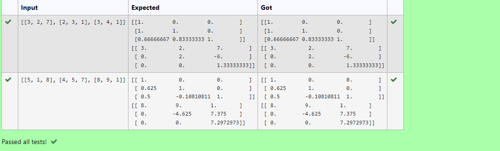
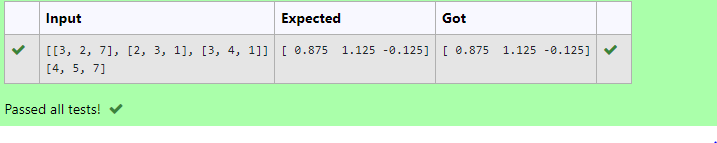

# LU Decomposition without zero on the diagonal

## AIM:
To write a program to find the LU Decomposition of a matrix.

## Equipments Required:
1. Hardware – PCs
2. Anaconda – Python 3.7 Installation / Moodle-Code Runner

## Algorithm
1. Get the input of the matrix from user
2. Import numpy and scipy
3. Import lu operator from scipy
4. Solve using lu operator and print l and u matrices

## Program:
```
/*
Program to find the LU Decomposition of a matrix.
Developed by: Nithishkumar P
RegisterNumber: 21005889
*/
import numpy as np
from scipy.linalg import lu
a= np.array(eval(input()))
p,l,u=lu(a)
print(l)
print(u)
```
## Output:



## Result:
Thus the program to find the LU Decomposition of a matrix is written and verified using python programming.


# Solve the equation using LU Decomposition

## AIM:
To write a program to solve the equation using LU Decomposition.

## Equipments Required:
1. Hardware – PCs
2. Anaconda – Python 3.7 Installation / Moodle-Code Runner

## Algorithm
1. Get the input of the matrix from user
2. Import numpy and scipy
3. Import lu_factor and lu_solve operator from scipy
4. Find pivot matrix of first matrix using lu_factor and sovle second matrix and pivot matrix to get solution matrix  

## Program:
```
'''Program to solve a matrix using LU decomposition.
Developed by: Nithishkumar P 
RegisterNumber: 21005889
'''

# To print X matrix (solution to the equations)
import numpy as np
from scipy.linalg import lu_factor, lu_solve
a=np.array(eval(input()))
b=np.array(eval(input()))
lu,p=lu_factor(a)
x=lu_solve((lu,p),b)
print(x)
```

## Output:



## Result:
Thus the program to solve the equation using LU Decomposition is written and verified using python programming.

